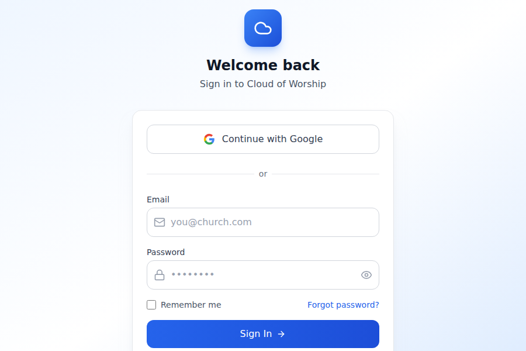

# Selah

A modern, real-time worship presentation application built with React, TypeScript, and Convex. Selah helps churches manage and display song lyrics, Bible verses, hymns, and media content during services.



## Features

### Core Functionality
- **Song Management** - Create, edit, and organize worship songs with verse/chorus structure
- **Bible Display** - Search and display Bible verses with multiple versions support
- **Hymn Library** - Access a comprehensive hymn library with lyrics and verses
- **Media Integration** - Display images, videos, and external content (YouTube, Vimeo)
- **Countdown Timers** - Create countdown timers for service start times
- **Alerts & Announcements** - Display priority alerts and announcements

### Presentation Features
- **Live Output** - Separate fullscreen output window for projection
- **Slide Preview** - Preview slides before going live
- **Quick Actions** - Rapid access to common tasks via keyboard shortcuts
- **Templates** - Save and reuse slide designs
- **Schedules** - Organize slides into service schedules

### Technical Features
- **Real-time Sync** - Changes sync instantly across all connected devices
- **Offline Support** - Continue working offline with IndexedDB persistence
- **Dark Mode** - Full dark mode support for comfortable viewing
- **Responsive Design** - Works on desktop and tablet devices
- **Keyboard Shortcuts** - Efficient navigation and control

## Tech Stack

- **Frontend**: React 19, TypeScript, Vite
- **Styling**: Tailwind CSS 4
- **State Management**: Zustand
- **Backend**: Convex (real-time database & functions)
- **Authentication**: Clerk
- **Offline Storage**: Dexie (IndexedDB wrapper)
- **Testing**: Vitest, React Testing Library

## Project Structure

```
presenta-react/
├── convex/                 # Convex backend functions and schema
│   ├── schema.ts          # Database schema definitions
│   ├── users.ts           # User management functions
│   ├── churches.ts        # Church organization functions
│   ├── slides.ts          # Slide CRUD operations
│   ├── songs.ts           # Song library functions
│   ├── schedules.ts       # Service schedule functions
│   └── templates.ts       # Template management
├── src/
│   ├── components/        # React components
│   │   ├── alerts/        # Alert creation modal
│   │   ├── bible/         # Bible selection list
│   │   ├── countdown/     # Countdown timer modal
│   │   ├── editor/        # Slide editor
│   │   ├── hymns/         # Hymn selection list
│   │   ├── library/       # Media library panel
│   │   ├── live/          # Live output display
│   │   ├── media/         # Media picker and upload
│   │   ├── modals/        # Various modal dialogs
│   │   ├── preview/       # Slide preview component
│   │   ├── quick-actions/ # Quick action buttons
│   │   ├── schedules/     # Schedule management
│   │   ├── settings/      # Settings modal
│   │   ├── slides/        # Slide card and chip components
│   │   ├── songs/         # Song list and management
│   │   ├── templates/     # Template browser
│   │   └── utils/         # Utility components
│   ├── hooks/             # Custom React hooks
│   ├── pages/             # Page components
│   │   ├── auth/          # Authentication pages
│   │   ├── Dashboard.tsx  # Main dashboard
│   │   ├── LiveView.tsx   # Fullscreen live output
│   │   └── ChurchSetup.tsx # Church creation/join
│   ├── services/          # External service integrations
│   ├── store/             # Zustand state store
│   └── types/             # TypeScript type definitions
├── public/                # Static assets
└── ...config files
```

## Getting Started

### Prerequisites

- Node.js 18+ or Bun
- A Convex account (free tier available)
- A Clerk account (free tier available)

### Installation

1. Clone the repository:
   ```bash
   git clone <repository-url>
   cd presenta-react
   ```

2. Install dependencies:
   ```bash
   bun install
   # or
   npm install
   ```

3. Set up environment variables:
   Create a `.env.local` file with:
   ```
   VITE_CONVEX_URL=your_convex_deployment_url
   VITE_CLERK_PUBLISHABLE_KEY=your_clerk_publishable_key
   ```

4. Start the development server:
   ```bash
   bun dev
   # or
   npm run dev
   ```

5. Open http://localhost:5173 in your browser

### Available Scripts

| Script | Description |
|--------|-------------|
| `dev` | Start development server with hot reload |
| `build` | Build for production |
| `preview` | Preview production build locally |
| `lint` | Run ESLint checks |
| `test` | Run tests once |
| `test:watch` | Run tests in watch mode |

## Usage Guide

### Creating a Church
1. Sign up for a new account
2. Create a new church or join an existing one using an invite code
3. Set up your church profile

### Managing Slides
1. Use the **Quick Actions** panel to create new slides
2. Choose from text, Bible verses, hymns, songs, or media
3. Edit slides using the slide editor
4. Drag and drop to reorder slides

### Going Live
1. Select a slide to preview
2. Click "Go Live" to send to the live output
3. Open the live view in a separate window for projection
4. Use keyboard shortcuts for quick navigation

### Keyboard Shortcuts

| Shortcut | Action |
|----------|--------|
| `Ctrl/Cmd + Z` | Undo |
| `Ctrl/Cmd + Y` | Redo |
| `Ctrl/Cmd + F` | Toggle fullscreen (live view) |
| Number keys | Quick slide selection |

## Contributing

Contributions are welcome! Please read our contributing guidelines before submitting a pull request.

1. Fork the repository
2. Create a feature branch (`git checkout -b feature/amazing-feature`)
3. Commit your changes (`git commit -m 'feat: add amazing feature'`)
4. Push to the branch (`git push origin feature/amazing-feature`)
5. Open a Pull Request

## License

This project is licensed under the MIT License - see the LICENSE file for details.

## Acknowledgments

- Built with [React](https://react.dev/) and [Vite](https://vite.dev/)
- Backend powered by [Convex](https://convex.dev/)
- Authentication by [Clerk](https://clerk.com/)
- Icons from [Lucide](https://lucide.dev/)
- Styling with [Tailwind CSS](https://tailwindcss.com/)
