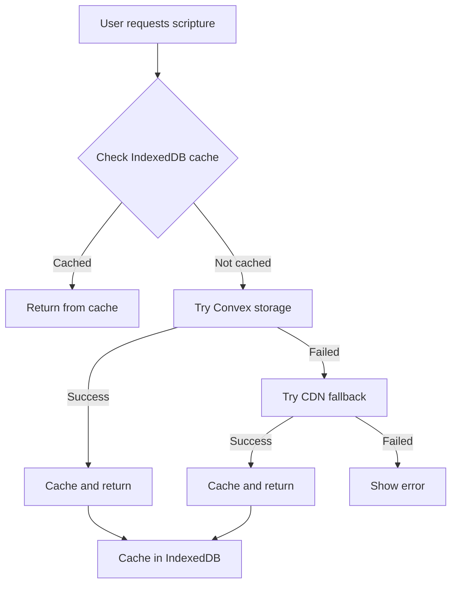

# Bible Data Hybrid Storage Plan

## Overview

This plan outlines a hybrid approach for Bible data storage that ensures app stability and data availability by:
1. Using Convex as the primary source for all Bible versions
2. Using the existing CDN as a fallback
3. Caching downloaded versions in IndexedDB for offline access

## Architecture



## Data Flow

### 1. Scripture Fetch Priority
1. **IndexedDB Cache** - Fastest, offline-capable
2. **Convex Storage** - Primary source for all versions
3. **CDN Fallback** - Legacy CDN as last resort

### 2. Bible Version Storage Locations

| Version | Convex | CDN |
|---------|--------|-----|
| KJV | ✅ Primary | ✅ Backup |
| ASV | ✅ Primary | ✅ Backup |
| WEB | ✅ Primary | ✅ Backup |
| YLT | ✅ Primary | ✅ Backup |
| NKJV | ✅ Primary | ✅ Backup |
| NIV | ✅ Primary | ✅ Backup |
| AMP | ✅ Primary | ✅ Backup |
| NLT | ✅ Primary | ✅ Backup |
| Others | ✅ Primary | ✅ Backup |

## Implementation Steps

### Step 1: Add Bible Versions Table to Convex Schema

Add a new table to store Bible version data:

```typescript
// convex/schema.ts
bibleVersions: defineTable({
    id: v.string(), // KJV, NIV, etc.
    name: v.string(),
    data: v.array(v.object({
        book: v.string(),
        chapter: v.string(),
        verse: v.string(),
        scripture: v.string(),
    })),
    copyrightContent: v.string(),
    isPublicDomain: v.boolean(),
    uploadedAt: v.string(),
    uploadedBy: v.string(),
}).index("by_id", ["id"])
```

### Step 2: Create Convex Functions

**convex/bibleVersions.ts**:
- `getBibleVersion(id: string)` - Fetch a Bible version by ID
- `listBibleVersions()` - List all available versions with metadata
- `uploadBibleVersion(id, name, data, copyrightContent)` - Admin: Upload a version
- `deleteBibleVersion(id)` - Admin: Delete a version

### Step 3: Update useScripture Hook

```typescript
// Pseudocode for fallback chain
async function fetchScripture(label, version) {
    // 1. Check IndexedDB cache
    const cached = await getFromIndexedDB(version)
    if (cached) return processScripture(cached, label)
    
    // 2. Try Convex
    try {
        const convexData = await convex.query(api.bibleVersions.getBibleVersion, { id: version })
        if (convexData) {
            await cacheInIndexedDB(version, convexData.data)
            return processScripture(convexData.data, label)
        }
    } catch (e) {
        console.warn('Convex fetch failed, trying CDN')
    }
    
    // 3. Fallback to CDN
    try {
        const cdnData = await fetchFromCDN(version)
        await cacheInIndexedDB(version, cdnData)
        return processScripture(cdnData, label)
    } catch (e) {
        throw new Error('Scripture not available')
    }
}
```

### Step 4: Admin Upload Function

Create a server-side script or admin UI to:
1. Download Bible versions from CDN
2. Upload to Convex storage
3. Verify data integrity

### Step 5: Update BibleVersionSettings Component

Show data source status:
- ✅ Downloaded (cached locally)
- ☁️ Available on Convex
- 🌐 CDN Only (not yet uploaded to Convex)

## File Structure

```
src/
├── hooks/
│   └── useScripture.ts       # Updated with fallback chain
├── services/
│   └── bible/
│       ├── index.ts          # Bible service exports
│       ├── convex.ts         # Convex Bible API
│       └── cdn.ts            # CDN fallback
convex/
├── schema.ts                 # Updated with bibleVersions table
└── bibleVersions.ts          # Bible version CRUD functions
```

## Benefits

1. **Self-Hosted Control** - Convex storage under your control
2. **Graceful Degradation** - Multiple fallbacks ensure availability
3. **Reduced CDN Dependency** - CDN is last resort, not primary
4. **Offline Support** - IndexedDB caching for all downloaded versions
5. **Smaller Bundle** - No bundled data keeps app lightweight

## Storage Considerations

- **Convex storage**: ~50-100MB total for all versions
- **IndexedDB**: User's device, grows as they download versions

## Next Steps

1. Switch to Code mode to implement Convex schema changes
2. Create Bible version upload script
3. Update useScripture hook with fallback chain
4. Upload Bible versions to Convex
5. Test the complete flow
