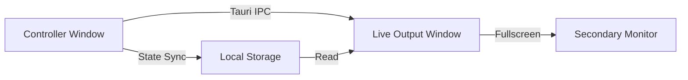

# Desktop App Enhancements Plan

Based on a review of the existing Selah architecture, here are desktop-specific enhancements that would truly differentiate the desktop app from the web version.

## Current State Analysis

The web app already has:
- ✅ Multi-monitor support via Presentation API
- ✅ Offline support with IndexedDB (Dexie)
- ✅ Real-time sync via Convex
- ✅ AI-powered sermon transcription
- ✅ Semantic verse search
- ✅ Bible integration
- ✅ Song/Hymn library
- ✅ Templates and schedules

## Proposed Desktop-Only Enhancements

### 1. Native Multi-Monitor Window Management

**Problem:** The current Presentation API requires user permission, has browser chrome, and can be unreliable.

**Solution:** Use Tauri's native window API for true multi-monitor support.

**Implementation:**
- Create a second Tauri window for live output
- Position window on secondary monitor automatically
- True fullscreen without browser chrome
- No permission prompts needed

### 2. Global Hotkeys

**Problem:** Web apps cannot register system-wide keyboard shortcuts.

**Solution:** Use Tauri's global shortcut plugin for system-wide hotkeys.

| Hotkey | Action |
|--------|--------|
| `Ctrl/Cmd + Right` | Next slide |
| `Ctrl/Cmd + Left` | Previous slide |
| `Ctrl/Cmd + Space` | Go live / Clear |
| `Ctrl/Cmd + B` | Blank screen |
| `Escape` | Emergency clear |

**Benefit:** Control presentation from anywhere, even when app is not focused.

### 3. System Tray / Menu Bar App

**Problem:** Users need to keep the app visible to control presentations.

**Solution:** Add a system tray icon with quick controls.

**Features:**
- Current slide preview thumbnail
- Next/Previous buttons
- Go Live / Clear buttons
- Recent presentations list
- Settings shortcut

### 4. Local Whisper.cpp Integration

**Problem:** Current transcription requires external server or cloud API.

**Solution:** Bundle whisper.cpp binary with the desktop app.

**Benefits:**
- No internet required for transcription
- Lower latency
- No API costs
- Privacy - audio never leaves the machine

**Implementation:**
- Bundle whisper.cpp as external binary
- Use Tauri's sidecar feature
- Auto-detect optimal model size

### 5. Native File Dialogs and Drag-Drop

**Problem:** Web file inputs are limited and don't feel native.

**Solution:** Use Tauri's dialog and filesystem plugins.

**Features:**
- Native open/save dialogs
- Drag-drop files directly into app
- Import presentations from files
- Export to PDF/PPTX
- Watch folders for new media

### 6. Auto-Update System

**Problem:** Web apps update automatically, but desktop apps need manual updates.

**Solution:** Configure the already-installed Tauri updater plugin.

**Implementation:**
- Set up update server endpoint
- Configure public key signing
- Add update notification UI
- Background download with user prompt to install

### 7. Window State Persistence

**Problem:** Users need to reposition windows every time they open the app.

**Solution:** Save and restore window positions.

**Features:**
- Remember controller window position
- Remember live output monitor
- Remember app preferences
- Restore on app launch

### 8. Custom Title Bar

**Problem:** Default title bar takes up space and doesn't match app design.

**Solution:** Create a custom title bar with app controls.

**Features:**
- Sleek, minimal design
- Integrated controls (minimize, maximize, close)
- Custom drag region
- Presentation controls in title bar

---

## Priority Ranking

| Priority | Enhancement | Impact | Complexity |
|----------|-------------|--------|------------|
| 1 | Native Multi-Monitor | High | Medium |
| 2 | Global Hotkeys | High | Low |
| 3 | Auto-Update | High | Low |
| 4 | System Tray | Medium | Medium |
| 5 | Window State Persistence | Medium | Low |
| 6 | Native File Dialogs | Medium | Low |
| 7 | Local Whisper | High | High |
| 8 | Custom Title Bar | Low | Medium |

---

## Implementation Order

### Phase 1: Core Desktop Features
1. Native multi-monitor window management
2. Global hotkeys for presentation control
3. Auto-update configuration

### Phase 2: Quality of Life
4. Window state persistence
5. Native file dialogs
6. System tray app

### Phase 3: Advanced Features
7. Local Whisper.cpp integration
8. Custom title bar

---

## Questions for User

1. Which of these enhancements are most valuable to you?
2. Are there any other desktop-specific features you'd like to see?
3. Should we prioritize local Whisper integration for offline transcription?
4. Do you want a system tray app for quick presentation control?
