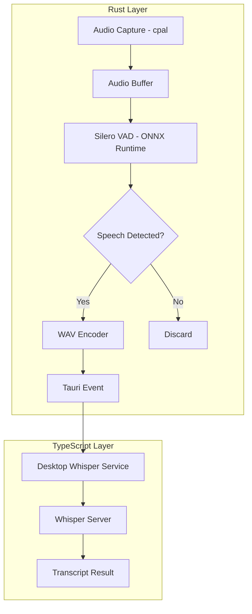

# Native Silero VAD Integration Plan

## Overview

Integrate Silero VAD (Voice Activity Detection) with the native Rust audio capture to provide the same high-quality VAD that the web version uses, but with lower latency and no JavaScript bridge overhead.

## Architecture



## Implementation Steps

### 1. Add Dependencies

Add to `src-tauri/Cargo.toml`:
```toml
ort = "2.0"  # ONNX Runtime bindings for Rust
ndarray = "0.15"  # For tensor operations
```

### 2. Add Silero VAD Model

- Copy `public/silero_vad_legacy.onnx` to `src-tauri/assets/silero_vad.onnx`
- Configure Tauri to include the asset

### 3. Create VAD Module

Create `src-tauri/src/audio_capture/vad.rs`:

```rust
//! Silero VAD implementation using ONNX Runtime

use ort::{GraphOptimizationLevel, Session};
use ndarray::{Array1, Array2, s};

pub struct SileroVad {
    session: Session,
    h: Array1<f32>,  // Hidden state
    c: Array1<f32>,  // Cell state
    sample_rate: i64,
}

impl SileroVad {
    pub fn new(model_path: &str) -> Result<Self, String> {
        let session = Session::builder()
            .map_err(|e| format!("Failed to create session builder: {}", e))?
            .with_optimization_level(GraphOptimizationLevel::Level3)
            .map_err(|e| format!("Failed to set optimization level: {}", e))?
            .commit_from_file(model_path)
            .map_err(|e| format!("Failed to load model: {}", e))?;

        Ok(Self {
            session,
            h: Array1::zeros(64),
            c: Array1::zeros(64),
            sample_rate: 16000,
        })
    }

    /// Process a chunk of audio and return speech probability
    /// Audio must be 16kHz mono f32 samples
    pub fn process(&mut self, audio: &[f32]) -> Result<f32, String> {
        // Silero VAD expects 512, 768, or 1024 samples per call
        let chunk_size = audio.len();
        if chunk_size != 512 && chunk_size != 768 && chunk_size != 1024 {
            return Err(format!("Invalid chunk size: {}, expected 512, 768, or 1024", chunk_size));
        }

        // Create input tensor
        let input = Array2::from_shape_vec((1, chunk_size), audio.to_vec())
            .map_err(|e| format!("Failed to create input tensor: {}", e))?;

        // Run inference
        // Inputs: input, sr, h, c
        // Outputs: output, hn, cn
        let outputs = self.session
            .run(ort::inputs![
                "input" => input.view(),
                "sr" => ndarray::array![self.sample_rate],
                "h" => self.h.clone().into_shape((2, 1, 64)).unwrap(),
                "c" => self.c.clone().into_shape((2, 1, 64)).unwrap(),
            ].map_err(|e| format!("Failed to create inputs: {}", e))?)
            .map_err(|e| format!("Inference failed: {}", e))?;

        // Get output probability
        let output = outputs["output"]
            .try_extract_tensor::<f32>()
            .map_err(|e| format!("Failed to extract output: {}", e))?;
        let probability = output[[0, 0]];

        // Update hidden states
        let hn = outputs["hn"]
            .try_extract_tensor::<f32>()
            .map_err(|e| format!("Failed to extract hn: {}", e))?;
        let cn = outputs["cn"]
            .try_extract_tensor::<f32>()
            .map_err(|e| format!("Failed to extract cn: {}", e))?;

        self.h = hn.slice(s![0, 0, ..]).to_owned();
        self.c = cn.slice(s![0, 0, ..]).to_owned();

        Ok(probability)
    }

    /// Reset VAD state (call when starting new capture)
    pub fn reset(&mut self) {
        self.h = Array1::zeros(64);
        self.c = Array1::zeros(64);
    }
}
```

### 4. Integrate with Audio Capture

Modify `src-tauri/src/audio_capture/mod.rs`:

```rust
mod vad;

pub struct AudioCaptureState {
    // ... existing fields ...
    pub vad: Mutex<Option<vad::SileroVad>>,
    pub speech_buffer: Mutex<Vec<f32>>,
    pub is_speaking: AtomicBool,
    pub speech_start_time: Mutex<Option<std::time::Instant>>,
}

// In the audio processing loop:
// 1. Buffer audio in 512-sample chunks
// 2. Run VAD on each chunk
// 3. If speech detected, accumulate in speech_buffer
// 4. When speech ends, emit complete utterance as WAV
```

### 5. VAD Configuration

Add configuration options:
- `speech_threshold`: 0.5 (default) - probability threshold for speech
- `silence_threshold`: 0.35 (default) - probability threshold for silence
- `min_speech_ms`: 250 - minimum speech duration
- `min_silence_ms`: 100 - minimum silence to end speech
- `speech_pad_ms`: 30 - padding around speech

### 6. TypeScript Integration

Update `nativeAudioCapture.ts` to handle VAD-processed events:

```typescript
// New event type for VAD-processed audio
interface VadAudioChunkEvent {
    wav_base64: string;
    duration_ms: number;
    speech_probability: number;
}

// Listen for VAD-processed events
listen<VadAudioChunkEvent>('vad-audio-chunk', (event) => {
    // Audio is already VAD-processed - only speech
    onWavChunk(event.payload.wav_base64, event.payload.duration_ms);
});
```

## Benefits

1. **Lower Latency**: No JavaScript bridge for VAD processing
2. **Better Accuracy**: Same Silero VAD model as web version
3. **Complete Utterances**: Words not cut off at chunk boundaries
4. **Less Noise**: Only speech is sent to Whisper

## Testing Plan

1. Test VAD detection accuracy with various audio levels
2. Compare transcription quality with web-based VAD
3. Measure latency improvement
4. Test with different microphones and environments
