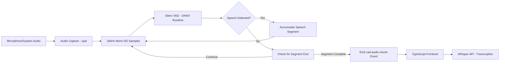

# Plan: Replace Time-Based Chunking with VAD-Based Chunking

## Overview

Replace the legacy time-based audio chunking (`start_capture_with_events` / `audio-chunk-wav`) with VAD-based chunking (`start_capture_with_vad` / `vad-audio-chunk`) for better transcription accuracy and efficiency.

## Current State

### Time-Based Chunking (Legacy - To Remove)
- **Rust Command:** `start_capture_with_events`
- **Event:** `audio-chunk-wav`
- **Behavior:** Emits chunks every N seconds regardless of speech content
- **Files:**
  - `src-tauri/src/audio_capture/mod.rs` - `start_capture_with_events()` function
  - `src-tauri/src/main.rs` - Command registration
  - `src/services/sermon-listener/nativeAudioCapture.ts` - `startWithEvents()` method

### VAD-Based Chunking (New - To Use)
- **Rust Command:** `start_capture_with_vad`
- **Event:** `vad-audio-chunk`
- **Behavior:** Only emits complete speech segments detected by Silero VAD
- **Files:**
  - `src-tauri/src/audio_capture/mod.rs` - `start_capture_with_vad()` function
  - `src-tauri/src/audio_capture/vad.rs` - Silero VAD implementation
  - `src/services/sermon-listener/nativeVadCapture.ts` - VAD capture service

## Changes Required

### 1. Update TypeScript Service

**File:** `src/services/sermon-listener/nativeAudioCapture.ts`

- Change `startWithEvents()` to use `start_capture_with_vad` instead of `start_capture_with_events`
- Update event listener from `audio-chunk-wav` to `vad-audio-chunk`
- Update event payload interface to match `VadAudioChunkEvent`
- Remove `chunkDurationMs` parameter (VAD uses fixed 32ms chunks internally)

### 2. Remove Legacy Rust Code

**File:** `src-tauri/src/audio_capture/mod.rs`

- Remove `start_capture_with_events()` function
- Remove `AudioChunkEvent` struct (only used by time-based chunking)

**File:** `src-tauri/src/main.rs`

- Remove `start_capture_with_events` from invoke_handler

### 3. Update Event Interface

**Current `audio-chunk-wav` payload:**
```typescript
interface AudioChunkWavEvent {
    wav_base64: string
    duration_ms: number
}
```

**New `vad-audio-chunk` payload:**
```typescript
interface VadAudioChunkEvent {
    wav_base64: string
    duration_ms: number
    is_speaking: boolean  // Additional field for speaking status
}
```

## Architecture After Changes



## Benefits

1. **Better Accuracy** - Only speech is sent to Whisper, no arbitrary cuts mid-word
2. **Lower Bandwidth** - No silence/noise chunks sent to API
3. **Better Context** - Complete utterances instead of time-based segments
4. **Simpler API** - No need to tune chunk duration parameter

## Implementation Steps

1. [ ] Update `nativeAudioCapture.ts` to use VAD-based capture
2. [ ] Remove `start_capture_with_events` from Rust code
3. [ ] Update `main.rs` to remove unused command registration
4. [ ] Test the VAD-based capture flow
