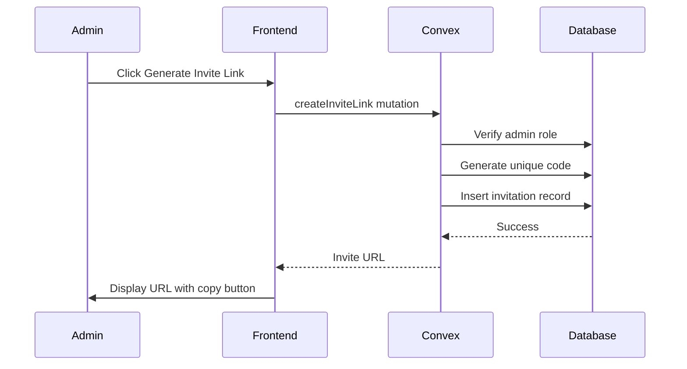
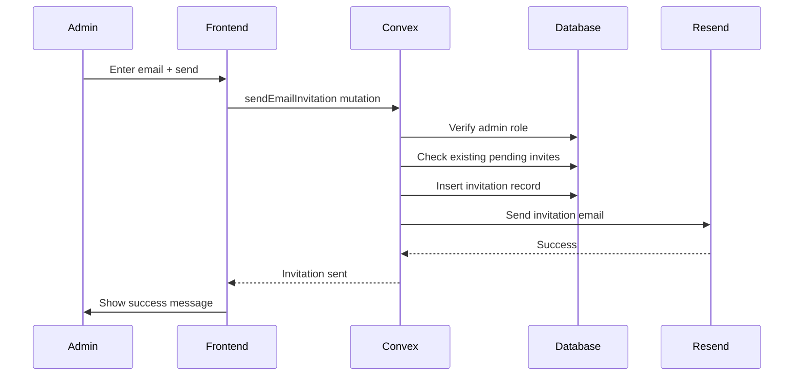
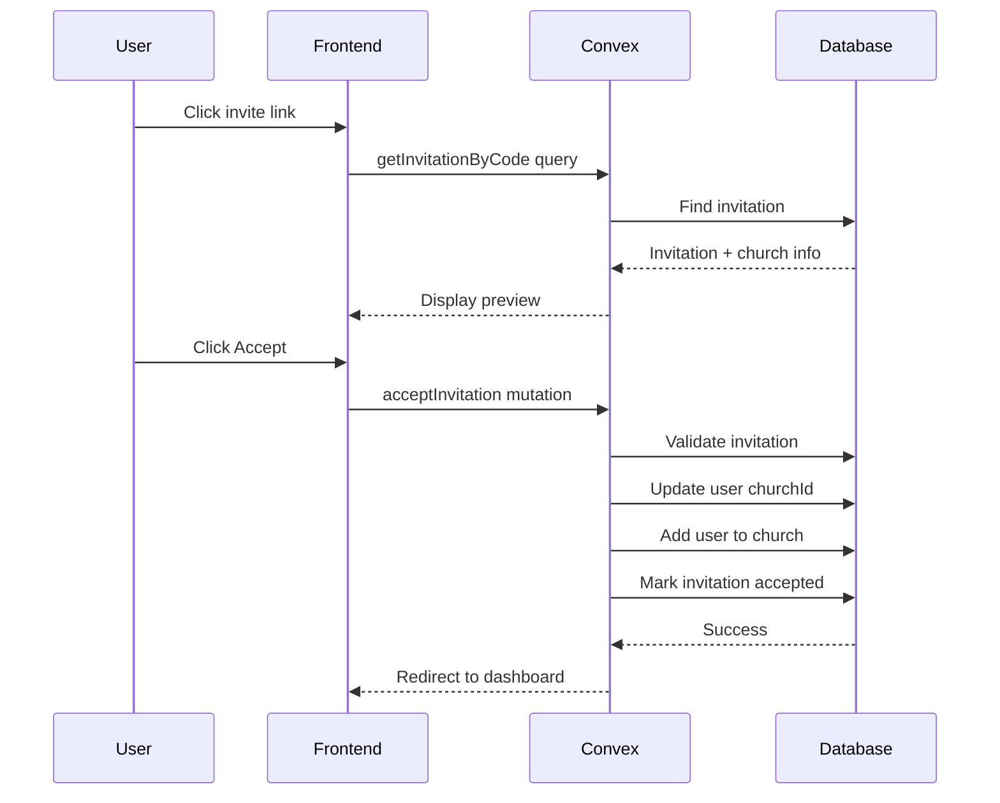

# Team Invitation System Implementation Plan

## Overview

This plan outlines the implementation of a team invitation system for Selah, enabling church administrators to invite team members via:
1. **Invite Links** - Shareable URLs (e.g., `selah.app/join/abc123`)
2. **Direct Email Invitations** - Send personalized invitation emails via Resend

## Current State Analysis

### Existing Infrastructure
- **Authentication**: Clerk handles user authentication
- **Database**: Convex with existing `churches` and `users` tables
- **Roles**: `superadmin`, `admin`, `member` hierarchy
- **Church Setup**: [`ChurchSetup.tsx`](src/pages/ChurchSetup.tsx) has UI for joining via invite code but backend is incomplete
- **Join Mutation**: [`joinChurch`](convex/churches.ts:73) exists but doesn't validate invite codes

### Gaps
- No `invitations` table in schema
- No invite code generation on church creation
- No email sending infrastructure
- No team management UI for admins

---

## Database Schema Changes

### New Table: `invitations`

```typescript
// convex/schema.ts - Add to existing schema

invitations: defineTable({
  // Unique invite code (URL-safe, used in join links)
  code: v.string(),
  
  // Church this invitation belongs to
  churchId: v.string(),
  
  // Type of invitation
  type: v.union(
    v.literal("link"),      // Generic shareable link
    v.literal("email")      // Direct email invitation
  ),
  
  // For email invitations: recipient email
  email: v.optional(v.string()),
  
  // User who created the invitation
  createdBy: v.string(),
  
  // Status tracking
  status: v.union(
    v.literal("pending"),    // Not yet accepted
    v.literal("accepted"),   // User joined via this invite
    v.literal("revoked"),    // Admin revoked the invite
    v.literal("expired")     // Past expiration date
  ),
  
  // Who accepted the invitation (filled on join)
  acceptedBy: v.optional(v.string()),
  acceptedAt: v.optional(v.string()),
  
  // Timestamps
  createdAt: v.string(),
  updatedAt: v.string(),
  
  // Optional expiration (null = never expires)
  expiresAt: v.optional(v.string()),
  
  // Optional note from inviter
  message: v.optional(v.string()),
})
  .index("by_code", ["code"])
  .index("by_church", ["churchId"])
  .index("by_email", ["email"])
  .index("by_status", ["status"])
```

### Update `churches` Table

Add a default invite code field for quick sharing:

```typescript
// Add to churches schema
defaultInviteCode: v.optional(v.string()),
```

---

## API Endpoints (Convex Functions)

### Queries

#### `getInvitations`
Get all invitations for a church (admin only).

```typescript
// convex/invitations.ts
export const getInvitations = query({
  args: { churchId: v.string() },
  handler: async (ctx, args) => {
    // Verify user is admin of this church
    // Return all invitations sorted by createdAt desc
  }
});
```

#### `getInvitationByCode`
Validate an invite code (public, no auth required).

```typescript
export const getInvitationByCode = query({
  args: { code: v.string() },
  handler: async (ctx, args) => {
    // Return church info + invitation status
    // Used on /join/:code page to show preview
  }
});
```

#### `getMyInvitations`
Get pending invitations for current user (by email).

```typescript
export const getMyInvitations = query({
  args: {},
  handler: async (ctx, args) => {
    // Get user email from auth
    // Return pending invitations for this email
  }
});
```

### Mutations

#### `createInviteLink`
Generate a new shareable invite link.

```typescript
export const createInviteLink = mutation({
  args: {
    churchId: v.string(),
    expiresInDays: v.optional(v.number()), // null = never expires
    message: v.optional(v.string()),
  },
  handler: async (ctx, args) => {
    // 1. Verify user is admin of this church
    // 2. Generate unique code (nanoid or similar)
    // 3. Create invitation record
    // 4. Return full invite URL
  }
});
```

#### `sendEmailInvitation`
Send direct email invitation via Resend.

```typescript
export const sendEmailInvitation = mutation({
  args: {
    churchId: v.string(),
    email: v.string(),
    message: v.optional(v.string()),
    expiresInDays: v.optional(v.number()),
  },
  handler: async (ctx, args) => {
    // 1. Verify user is admin of this church
    // 2. Check if email already has pending invite
    // 3. Generate unique code
    // 4. Create invitation record
    // 5. Call Resend API to send email
    // 6. Return success status
  }
});
```

#### `acceptInvitation`
Accept an invitation and join the church.

```typescript
export const acceptInvitation = mutation({
  args: {
    code: v.string(),
  },
  handler: async (ctx, args) => {
    // 1. Validate invitation exists and is pending
    // 2. Check expiration
    // 3. Get or create user
    // 4. Update user's churchId
    // 5. Add user to church's userIds array
    // 6. Mark invitation as accepted
    // 7. Return success
  }
});
```

#### `revokeInvitation`
Revoke a pending invitation.

```typescript
export const revokeInvitation = mutation({
  args: {
    invitationId: v.string(),
  },
  handler: async (ctx, args) => {
    // 1. Verify user is admin of the invitation's church
    // 2. Update status to "revoked"
  }
});
```

#### `regenerateInviteCode`
Generate a new code for an existing invitation.

```typescript
export const regenerateInviteCode = mutation({
  args: {
    invitationId: v.string(),
  },
  handler: async (ctx, args) => {
    // Generate new code, update invitation
  }
});
```

---

## Email Service Integration (Resend)

### Setup

1. Install Resend SDK:
   ```bash
   npm install resend
   ```

2. Add environment variable:
   ```
   RESEND_API_KEY=re_xxx
   ```

3. Create email service:
   ```typescript
   // src/services/email/index.ts
   import { Resend } from 'resend';
   
   const resend = new Resend(process.env.RESEND_API_KEY);
   
   export async function sendInvitationEmail(params: {
     to: string;
     churchName: string;
     inviterName: string;
     inviteUrl: string;
     message?: string;
   }) {
     // Send via Resend
   }
   ```

### Email Template

```
Subject: {inviterName} invited you to join {churchName} on Selah

---

You've been invited to join {churchName}'s media team on Selah!

{message}

Click the button below to accept the invitation:
[Join {churchName}]

Or visit: {inviteUrl}

This invitation will expire on {expirationDate}.

---

Selah - AI-Powered Worship Presentation
```

### Convex HTTP Action for Email

Since Convex mutations can't make external HTTP calls directly, use an HTTP action:

```typescript
// convex/emails.ts
import { httpAction } from "./_generated/server";

export const sendInviteEmail = httpAction(async (ctx, request) => {
  const { to, churchName, inviterName, inviteUrl, message } = await request.json();
  
  // Call Resend API
  // Return success/error
});
```

---

## Frontend Components

### 1. Team Management Panel

Location: New tab in Settings or dedicated page

```typescript
// src/components/team/TeamManagementPanel.tsx

interface TeamManagementPanelProps {
  churchId: string;
}

// Features:
// - List current team members with roles
// - Generate new invite links
// - Send email invitations
// - View pending invitations
// - Revoke invitations
// - Copy invite link to clipboard
```

### 2. Invite Link Generator

```typescript
// src/components/team/InviteLinkGenerator.tsx

// Modal/Panel for creating invite links
// - Option to set expiration
// - Copy button with feedback
// - QR code generation (optional)
```

### 3. Email Invitation Form

```typescript
// src/components/team/EmailInvitationForm.tsx

// Form for sending email invitations
// - Email input (multiple emails support)
// - Optional personal message
// - Expiration settings
// - Send button with loading state
```

### 4. Join Page (Public)

```typescript
// src/pages/JoinChurch.tsx

// Route: /join/:code
// - Validate invite code
// - Show church info preview
// - "Accept Invitation" button
// - Redirect to dashboard on success
```

### 5. Pending Invitations Banner

```typescript
// src/components/team/PendingInvitationsBanner.tsx

// Show on dashboard if user has pending invitations
// - "You've been invited to join {churchName}"
// - Accept/Decline buttons
```

---

## User Flows

### Flow 1: Admin Generates Invite Link



### Flow 2: Admin Sends Email Invitation



### Flow 3: User Accepts Invitation



---

## Security Considerations

### 1. Authorization Checks
- Only `admin` or `superadmin` can create/revoke invitations
- Users can only accept invitations for themselves

### 2. Invite Code Security
- Use cryptographically secure random codes (nanoid with 21 chars)
- Codes are single-use for email invitations
- Link invitations can be multi-use (configurable)

### 3. Rate Limiting
- Limit invitation creation per admin (e.g., 10/hour)
- Limit email sending to prevent abuse

### 4. Email Validation
- Validate email format before sending
- Check if email corresponds to existing user

### 5. Expiration
- Default expiration: 7 days for email, 30 days for links
- Maximum expiration: 90 days

---

## Implementation Phases

### Phase 1: Database & Core Backend
1. Update Convex schema with `invitations` table
2. Create `convex/invitations.ts` with all mutations/queries
3. Update `joinChurch` mutation to use invitation system
4. Add `defaultInviteCode` to churches on creation

### Phase 2: Email Service
1. Set up Resend account and API key
2. Create email service module
3. Create Convex HTTP action for sending emails
4. Design and implement email template

### Phase 3: Frontend - Admin Features
1. Create Team Management Panel component
2. Add Invite Link Generator
3. Add Email Invitation Form
4. Add to Settings modal or create dedicated Team page

### Phase 4: Frontend - Join Flow
1. Create `/join/:code` route
2. Create JoinChurch page component
3. Update ChurchSetup to use new invitation system
4. Add pending invitations banner

### Phase 5: Polish & Testing
1. Add loading states and error handling
2. Add success notifications (toasts)
3. Write unit tests for invitation logic
4. Test email deliverability

---

## File Structure

```
convex/
  invitations.ts          # New file - invitation mutations/queries
  emails.ts               # New file - HTTP action for Resend
  schema.ts               # Updated - add invitations table

src/
  components/
    team/
      TeamManagementPanel.tsx    # New
      InviteLinkGenerator.tsx    # New
      EmailInvitationForm.tsx    # New
      PendingInvitationsBanner.tsx # New
      index.ts                   # New - exports
  pages/
    JoinChurch.tsx              # New - /join/:code route
  services/
    email/
      index.ts                  # New - Resend integration
      templates/
        invitation.tsx          # New - email template
```

---

## Environment Variables

Add to `.env.local`:

```
RESEND_API_KEY=re_xxxxxxxxxxxx
RESEND_FROM_EMAIL=noreply@selah.app
```

---

## Questions Resolved

- **Invite Code Format**: Full URLs (`selah.app/join/abc123`)
- **Email Service**: Resend
- **Code Generation**: nanoid (21 characters, URL-safe)